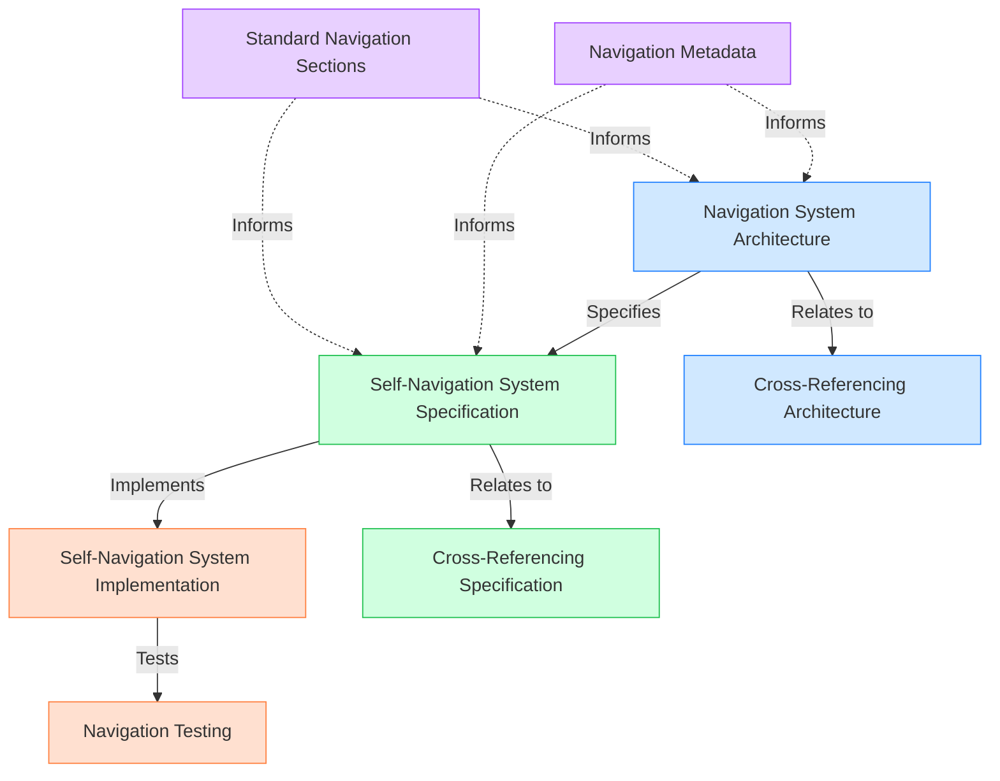
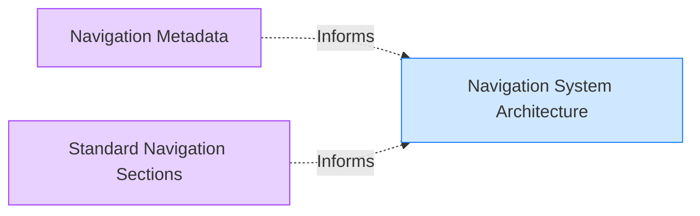
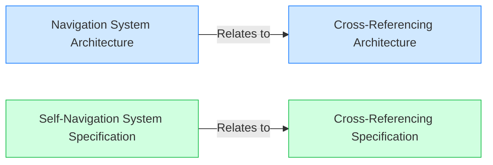

# Navigation System Relationship Map

> **Navigation**: [Documentation Index](/docs/index.md) > [Maps](/docs/maps/index.md) > Navigation System Relationship Map
>
> **Prerequisites**: [Relationship Visualization](/docs/relationship-visualization.md), [Cross-Referencing Mechanism](/docs/cross-referencing.md)
>
> **Context**: This document provides a visual map of the relationships between documents in the navigation system.

## Overview

This document visualizes the relationships between documents that constitute the navigation system in the Meatware framework. The navigation system enables AI tools and humans to navigate the framework independently through a self-guided approach.

## Prerequisites

Before reading this document, you should be familiar with:

- [Relationship Visualization](/docs/relationship-visualization.md) - How relationships are visualized in the framework
- [Cross-Referencing Mechanism](/docs/cross-referencing.md) - The system for establishing relationships

## Navigation System Document Relationships

The following diagram shows the relationships between key documents in the navigation system:

### Document Descriptions

**Knowledge Documents**:
- **Navigation System Architecture** - `/knowledge/architecture/navigation-system.md`: Provides the architectural overview of the navigation system
- **Cross-Referencing Architecture** - `/knowledge/architecture/cross-referencing.md`: Details the architecture of the cross-referencing system

**Specification Documents**:
- **Self-Navigation System Specification** - `/specification/navigation/self-navigation-system.md`: Formal specification for the self-navigation system
- **Cross-Referencing Specification** - `/specification/navigation/cross-referencing.md`: Formal specification for the cross-referencing system

**Implementation Documents**:
- **Self-Navigation System Implementation** - `/project-implementation/implementation-log/self-navigation-system.md`: Implementation details for the self-navigation system
- **Navigation Testing** - `/project-implementation/implementation-log/navigation-testing.md`: Testing and validation of the navigation system

**Documentation Documents**:
- **Navigation Metadata** - `/docs/navigation-metadata.md`: Specification of navigation metadata fields
- **Standard Navigation Sections** - `/docs/standard-navigation-sections.md`: Documentation of standard navigation sections

## Key Relationship Patterns

### Knowledge to Specification Flow

Knowledge documents provide the architectural foundation for specifications:

### Specification to Implementation Flow

Specifications define what should be implemented:

### Documentation Support Flow

Documentation supports architecture and specifications:

### Cross-System Relationships

Navigation and cross-referencing systems are related:

## Navigation Paths

The navigation system supports several key navigation paths:

### Learning Path

For new users seeking to understand the navigation system:

1. Start with `/knowledge/architecture/navigation-system.md`
2. Proceed to `/docs/navigation-metadata.md` and `/docs/standard-navigation-sections.md`
3. Continue to `/specification/navigation/self-navigation-system.md`
4. Explore implementation at `/project-implementation/implementation-log/self-navigation-system.md`

### Implementation Path

For developers implementing navigation features:

1. Start with `/specification/navigation/self-navigation-system.md`
2. Reference `/knowledge/architecture/navigation-system.md` for architectural context
3. Consult `/docs/navigation-metadata.md` and `/docs/standard-navigation-sections.md` for details
4. Implement according to `/project-implementation/implementation-log/self-navigation-system.md`
5. Validate using approaches in `/project-implementation/implementation-log/navigation-testing.md`

## Related Documents

- [Navigation System Architecture](/knowledge/architecture/navigation-system.md) - Architectural overview of the navigation system
- [Self-Navigation System Specification](/specification/navigation/self-navigation-system.md) - Formal specification of the navigation system
- [Cross-Referencing Mechanism](/docs/cross-referencing.md) - The system for establishing relationships
- [Relationship Visualization](/docs/relationship-visualization.md) - How relationships are visualized

## Next Steps

After reading this document, you may want to explore:

- [Dependency Map](/docs/maps/dependency-map.md) - Visualization of dependencies between documents

## Notes

This map focuses on the core navigation system documents and their relationships. Additional documents that have peripheral relationships to the navigation system may not be included to maintain clarity and focus.

---

**Next Steps**: [Dependency Map](/docs/maps/dependency-map.md)

**Related Topics**: [Navigation System Architecture](/knowledge/architecture/navigation-system.md) | [Self-Navigation System Specification](/specification/navigation/self-navigation-system.md)

**Navigation Path**: [Home](/index.md) > [Documentation](/docs/index.md) > [Maps](/docs/maps/index.md) > [Navigation System Relationship Map](/docs/maps/navigation-map.md)