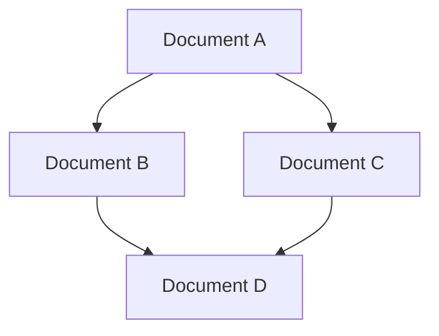
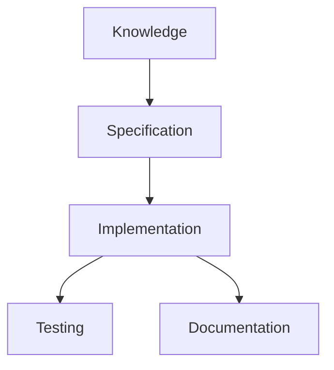
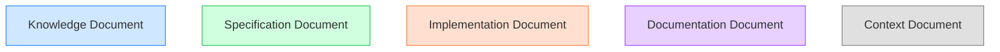
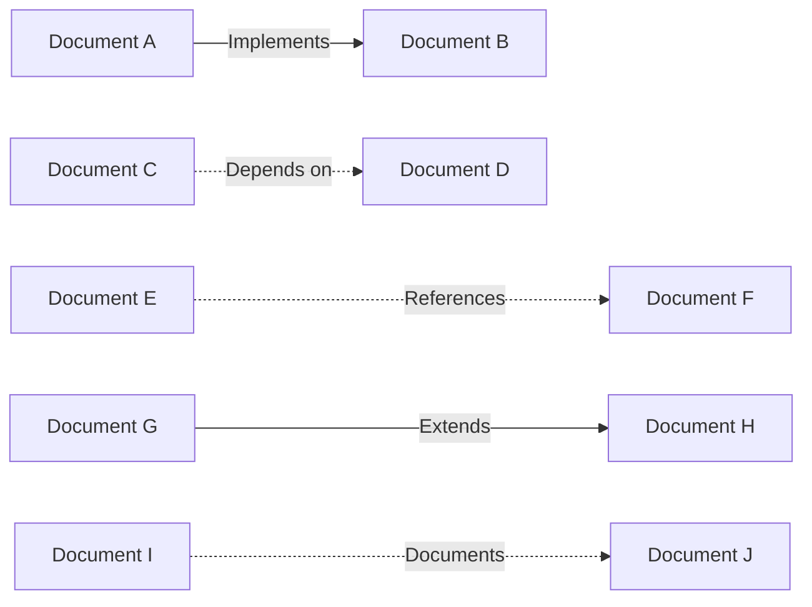

# Relationship Visualization

> **Navigation**: [Documentation Index](/docs/index.md) > Relationship Visualization
>
> **Prerequisites**: [Cross-Referencing Mechanism](/docs/cross-referencing.md)
>
> **Context**: This document explains how to visualize relationships between documents in the Meatware framework.

## Overview

Relationship visualization provides graphical representations of the connections between documents in the Meatware framework. These visualizations help users understand the structure of the framework, discover related documents, and navigate the complex web of relationships between different components.

## Prerequisites

Before reading this document, you should be familiar with:

- [Cross-Referencing Mechanism](/docs/cross-referencing.md) - The system for establishing relationships between documents

## Visualization Types

The Meatware framework uses several types of visualizations to represent document relationships:

### Mermaid Diagrams

Mermaid diagrams are inline markdown diagrams that can be rendered directly within documentation. They use a simple syntax to represent relationships between entities:

```markdown

```

This renders as:


Mermaid diagrams are preferred for simple relationship visualizations that can be included directly in documentation.

### Relationship Maps

Relationship maps are more complex visualizations stored as separate files in the `/docs/maps/` directory. These maps focus on specific relationship types or document categories:

- [Navigation Map](/docs/maps/navigation-map.md) - Shows navigation paths through the framework
- [Dependency Map](/docs/maps/dependency-map.md) - Visualizes dependency relationships between documents
- [Knowledge Map](/docs/maps/knowledge-map.md) - Maps relationships between knowledge documents
- [Implementation Map](/docs/maps/implementation-map.md) - Shows relationships between specifications and implementations

These maps are implemented as markdown files with embedded Mermaid diagrams or links to SVG files.

### Matrix Representations

Matrix representations show relationships in a tabular format, which can be useful for complex relationship networks:

| Source Document | Relationship | Target Document |
|-----------------|--------------|-----------------|
| Document A | Implements | Document B |
| Document C | References | Document A |
| Document B | Depends on | Document D |
| Document D | Extends | Document E |

This format is particularly useful for dense relationship networks where graphical representations might become cluttered.

## Implementation Guidelines

### Creating Mermaid Diagrams

To create a Mermaid diagram for document relationships:

1. Identify the documents to include in the visualization
2. Determine the relationships between these documents
3. Select the appropriate diagram type (flowchart, sequence diagram, etc.)
4. Create the diagram using Mermaid syntax
5. Include the diagram in the relevant documentation

Example:

```markdown

```

### Creating Relationship Maps

To create a new relationship map:

1. Create a new file in `/docs/maps/` with an appropriate name
2. Include standard metadata and navigation sections
3. Define the purpose and scope of the map
4. Include relevant visualizations (Mermaid diagrams or SVG files)
5. Provide explanatory text for the visualizations
6. Link to related documents and other maps

### Updating Visualizations

Visualizations should be updated when:

1. New documents are added to the framework
2. Existing documents are renamed or moved
3. Relationships between documents change
4. The structure of the framework evolves

Regular reviews of visualizations should be conducted to ensure they accurately reflect the current state of the framework.

## Standard Visualization Patterns

### Document Type Patterns

Different document types are represented using consistent visual patterns:

- **Knowledge Documents**: Rectangular nodes with blue fill
- **Specification Documents**: Rectangular nodes with green fill
- **Implementation Documents**: Rectangular nodes with orange fill
- **Documentation Documents**: Rectangular nodes with purple fill
- **Context Documents**: Rectangular nodes with gray fill

Example:



### Relationship Type Patterns

Different relationship types are represented using consistent arrow styles:

- **Implements**: Solid arrow with filled arrowhead
- **Depends on**: Dashed arrow with filled arrowhead
- **References**: Dotted arrow with open arrowhead
- **Extends**: Solid arrow with diamond tail
- **Documents**: Dashed arrow with open arrowhead

Example:



## Map Categories

### Navigation Maps

Navigation maps visualize how users and AI tools can navigate through the framework:

- Show primary navigation paths
- Highlight entry points and key documents
- Indicate recommended learning paths
- Show relationships between related documents

Example: [Navigation Map](/docs/maps/navigation-map.md)

### Dependency Maps

Dependency maps show how documents depend on each other:

- Visualize prerequisite relationships
- Show implementation dependencies
- Highlight circular dependencies
- Identify critical path dependencies

Example: [Dependency Map](/docs/maps/dependency-map.md)

### Component Maps

Component maps focus on specific components or features:

- Show all documents related to a specific feature
- Visualize the relationships within a component
- Link specifications, implementations, and documentation
- Highlight dependencies within and outside the component

Example: [Navigation Component Map](/docs/maps/navigation-component-map.md)

## Related Documents

- [Cross-Referencing Mechanism](/docs/cross-referencing.md) - The system for establishing relationships
- [Knowledge Architecture: Cross-Referencing](/knowledge/architecture/cross-referencing.md) - Architectural overview of cross-referencing
- [Metadata Format Specifications](/docs/metadata-format-specifications.md) - Specifications for document metadata

## Next Steps

After reading this document, you may want to explore:

- [Navigation Map](/docs/maps/navigation-map.md) - Map of navigation paths through the framework
- [Dependency Map](/docs/maps/dependency-map.md) - Map of dependencies between documents

## Notes

Relationship visualizations are meant to complement, not replace, the textual documentation of relationships. They provide a high-level overview that helps users understand the structure and connections within the framework, but detailed information should always be available in the text.

---

**Next Steps**: [Navigation Map](/docs/maps/navigation-map.md) | [Dependency Map](/docs/maps/dependency-map.md)

**Related Topics**: [Cross-Referencing Mechanism](/docs/cross-referencing.md) | [Knowledge Architecture: Cross-Referencing](/knowledge/architecture/cross-referencing.md)

**Navigation Path**: [Home](/index.md) > [Documentation](/docs/index.md) > [Relationship Visualization](/docs/relationship-visualization.md)