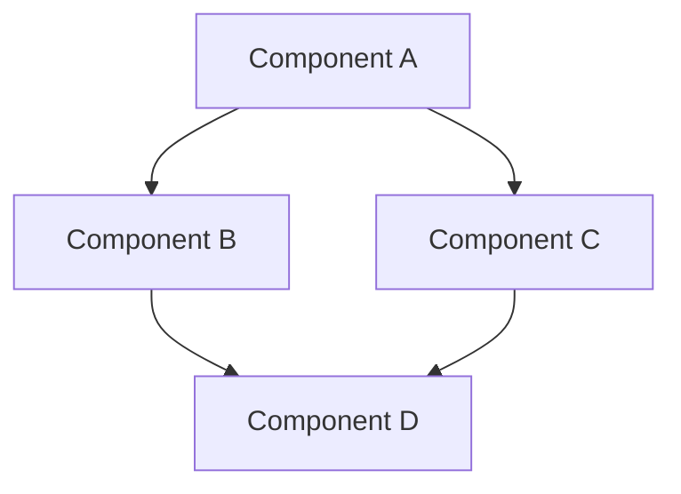

# Architecture Knowledge Title

> **Navigation**: [Knowledge Index](/knowledge/index.md) > [Architecture Index](/knowledge/architecture/index.md) > Architecture Knowledge Title
>
> **Prerequisites**: [Prerequisite 1](/path/to/prerequisite1.md), [Prerequisite 2](/path/to/prerequisite2.md)
>
> **Context**: This document provides an architectural overview of [component] within the framework.

## Purpose

Clear explanation of the architectural component being described, its role in the overall system, and why it's designed the way it is.

## Prerequisites

Before reading this document, you should be familiar with:

- [Prerequisite 1](/path/to/prerequisite1.md) - Brief description of relevance
- [Prerequisite 2](/path/to/prerequisite2.md) - Brief description of relevance

## Architectural Overview

High-level overview of the architecture, including:
- Purpose and goals
- Key design principles
- System boundaries
- Main components
- Core abstractions

## Architecture Diagram

Visual representation of the architecture:

## Key Components

### Component 1

Detailed description of the first key component:
- Purpose and responsibility
- Internal structure
- Interfaces and APIs
- Dependencies
- Design considerations

### Component 2

Detailed description of the second key component:
- Purpose and responsibility
- Internal structure
- Interfaces and APIs
- Dependencies
- Design considerations

### Component 3

Detailed description of the third key component:
- Purpose and responsibility
- Internal structure
- Interfaces and APIs
- Dependencies
- Design considerations

## Component Interactions

Description of how the components interact with each other:
- Communication patterns
- Data flow
- Control flow
- Dependency management
- Interface contracts

## Design Principles

Explanation of the key design principles that guided the architecture:

### Principle 1

Description of the first principle and how it's applied in the architecture.

### Principle 2

Description of the second principle and how it's applied in the architecture.

### Principle 3

Description of the third principle and how it's applied in the architecture.

## Trade-offs

Discussion of the architectural trade-offs made:

| Trade-off | Benefits | Drawbacks | Rationale |
|-----------|----------|-----------|-----------|
| Trade-off 1 | Benefits | Drawbacks | Why this trade-off was made |
| Trade-off 2 | Benefits | Drawbacks | Why this trade-off was made |
| Trade-off 3 | Benefits | Drawbacks | Why this trade-off was made |

## Security Considerations

Architectural security considerations:
- Authentication and authorization
- Data protection
- Communication security
- Threat modeling
- Security principles applied

## Performance Characteristics

Discussion of performance characteristics:
- Scalability considerations
- Performance bottlenecks
- Optimization strategies
- Resource usage
- Throughput and latency

## Error Handling and Resilience

Architectural approach to error handling and resilience:
- Error propagation
- Failure modes
- Recovery mechanisms
- Graceful degradation
- Circuit breaking

## Evolution and Extensibility

How the architecture supports evolution and extensibility:
- Extension points
- Versioning strategy
- Backward compatibility
- Forward compatibility
- Migration paths

## Implementation Guidelines

Guidelines for implementing the architecture:
- Key implementation considerations
- Technology recommendations
- Common pitfalls
- Best practices
- Testing approaches

## Related Architectures

- [Related Architecture 1](/knowledge/architecture/related-arch1.md) - Brief description of relationship
- [Related Architecture 2](/knowledge/architecture/related-arch2.md) - Brief description of relationship

## Next Steps

After reading this document, you may want to explore:

- [Next Step 1](/path/to/next1.md) - Brief description of relevance
- [Next Step 2](/path/to/next2.md) - Brief description of relevance

---

**Next Steps**: [Next Step 1](/path/to/next1.md) | [Next Step 2](/path/to/next2.md)

**Related Topics**: [Related Architecture 1](/knowledge/architecture/related-arch1.md) | [Related Architecture 2](/knowledge/architecture/related-arch2.md)

**Navigation Path**: [Home](/index.md) > [Knowledge](/knowledge/index.md) > [Architecture](/knowledge/architecture/index.md) > [Architecture Knowledge Title](/knowledge/architecture/architecture-knowledge-title.md)