# Knowledge Management System

> **Navigation**: [Knowledge Index](/knowledge/index.md) > [Architecture Index](/knowledge/architecture/index.md) > Knowledge Management System
>
> **Prerequisites**: [Navigation System](/knowledge/architecture/navigation-system.md), [Cross-Referencing System](/knowledge/architecture/cross-referencing.md)
>
> **Context**: This document explains the core concepts of the Knowledge Management System and provides a foundational understanding necessary for working with the framework.

## Purpose

The Knowledge Management System is the architectural foundation of the Meatware framework, responsible for organizing, categorizing, and structuring information in a way that is accessible to both humans and AI tools. It establishes patterns for knowledge representation, enables consistent navigation and cross-referencing, and ensures that information is properly contextualized and discoverable.

## Prerequisites

Before reading this document, you should be familiar with:

- [Navigation System](/knowledge/architecture/navigation-system.md) - Provides foundation for how knowledge is navigated
- [Cross-Referencing System](/knowledge/architecture/cross-referencing.md) - Establishes how knowledge elements reference each other

## Core Concept

The Knowledge Management System is an architectural pattern that structures and organizes information into a coherent, navigable knowledge base. It uses a combination of categorization, templating, metadata, and relational linking to create a structured knowledge environment that AI tools can consistently reference and humans can easily navigate.

### Key Principles

1. **Structured Organization**: Knowledge is organized into logical categories with clear boundaries and relationships.
2. **Template-Based Consistency**: Each knowledge type follows a standardized template that ensures consistent structure and information representation.
3. **Metadata-Driven Discovery**: Comprehensive metadata enables efficient navigation, search, and contextualization of knowledge elements.
4. **Explicit Relationships**: Relationships between knowledge elements are explicitly defined through cross-references and navigation paths.
5. **Evolutionary Documentation**: Knowledge evolves through clearly documented changes and decisions, capturing the evolution of understanding.
6. **Multi-Perspective Access**: Information can be accessed through multiple navigation paths, supporting different mental models and information needs.

### Components

The Knowledge Management System consists of several integrated components:

- **Knowledge Directory Structure**: Hierarchical organization of knowledge by category and type
- **Knowledge Templates**: Standardized formats for different types of knowledge
- **Knowledge Metadata**: YAML frontmatter providing contextual information and navigation aids
- **Cross-Referencing System**: Mechanism for establishing relationships between knowledge elements
- **Changelog System**: Process for documenting knowledge evolution and decisions
- **Clarity System**: Structure for capturing questions, answers, and insights
- **Indexing System**: Centralized access points for discovering knowledge elements

## Conceptual Model

The following diagram illustrates the relationships between the components of the Knowledge Management System:

```mermaid
graph TD
    KMS[Knowledge Management System] --> DS[Directory Structure]
    KMS --> TM[Templates]
    KMS --> MD[Metadata]
    KMS --> CR[Cross-References]
    KMS --> CL[Changelog]
    KMS --> CY[Clarity Documentation]
    KMS --> IX[Indexing System]
    
    DS --> CAT[Categories]
    DS --> TYPES[Knowledge Types]
    
    TM --> CON[Conceptual]
    TM --> REF[Reference]
    TM --> GU[Guide]
    TM --> DE[Decision]
    TM --> CLT[Clarity]
    TM --> CHL[Changelog]
    
    MD --> NAV[Navigation Metadata]
    MD --> REL[Relationship Metadata]
    MD --> CTX[Context Metadata]
    
    CR --> BI[Bidirectional Links]
    CR --> DEP[Dependencies]
    CR --> REL_MAPS[Relationship Maps]
    
    CL --> ENTRIES[Changelog Entries]
    CL --> DECISIONS[Decision Records]
    
    CY --> QA[Questions & Answers]
    CY --> INSIGHTS[Insights]
    
    IX --> DIR_INDEX[Directory Indexes]
    IX --> CAT_INDEX[Category Indexes]
    IX --> TYPE_INDEX[Type Indexes]
```



## Application

The Knowledge Management System is applied throughout the framework to organize and structure information:

### Use Cases

- **Contextual Knowledge Retrieval**: Enables AI tools to retrieve relevant context for tasks
- **Relationship Discovery**: Allows exploration of relationships between concepts and components
- **Evolution Tracking**: Documents how understanding evolves over time
- **Multi-Perspective Access**: Provides different entry points based on information needs
- **Standardized Documentation**: Ensures consistency in knowledge representation

### Implementation Examples

The Knowledge Management System is implemented through several key mechanisms:

```
/knowledge/
├── api/                # API documentation
│   ├── _template.md   # Template for API documentation
│   └── index.md       # API documentation index
├── architecture/       # Architectural patterns
│   ├── _template.md   # Template for architecture documentation
│   └── index.md       # Architecture documentation index
├── changelog/          # Decision logs and changes
│   ├── YYYY-MM-DD-change-description.md  # Changelog entries
│   └── index.md       # Changelog index
├── clarity/            # Q&A documentation
│   ├── framework-structure/  # Structure-related Q&A
│   ├── technical-implementation/  # Implementation-related Q&A
│   ├── usage-patterns/  # Usage-related Q&A
│   └── index.md       # Clarity documentation index
├── conventions/        # Custom conventions
│   ├── _template.md   # Template for convention documentation
│   └── index.md       # Conventions documentation index
├── integrations/       # Integration details
│   ├── _template.md   # Template for integration documentation
│   └── index.md       # Integrations documentation index
├── templates/          # Knowledge templates
│   ├── conceptual.md  # Template for conceptual knowledge
│   ├── reference.md   # Template for reference knowledge
│   ├── guide.md       # Template for guide knowledge
│   ├── decision.md    # Template for decision knowledge
│   ├── clarity.md     # Template for clarity knowledge
│   └── changelog.md   # Template for changelog entries
├── index.md            # Knowledge directory index
└── README.md           # Knowledge directory guide
```

## Common Patterns

### Pattern 1: Category-Based Organization

Knowledge is organized into categories that group related information. Each category has a consistent structure including:
- An index file providing an overview and linking to all category content
- A README file explaining the category's purpose and organization
- A _template file establishing the standard format for that category
- Topic-specific files containing the actual knowledge content

### Pattern 2: Template-Driven Documentation

Each knowledge type has a standardized template that ensures consistent structure:
- YAML frontmatter with standardized metadata fields
- Common sections appropriate to the knowledge type
- Consistent formatting and organization
- Standard navigation and cross-reference sections

### Pattern 3: Layered Navigation

Knowledge elements provide multiple navigation paths:
- Hierarchical: Moving up and down the directory structure
- Relational: Moving between related topics regardless of location
- Contextual: Discovering content based on use context
- Progressive: Following a learning or implementation path

## Anti-Patterns

### Anti-Pattern 1: Isolated Knowledge Silos

Storing knowledge without explicit relationships to other knowledge elements creates isolated silos that are difficult to discover and contextualize.

### Anti-Pattern 2: Inconsistent Structure

Using different structures, formats, or organizations for similar types of knowledge makes it difficult for both humans and AI tools to find and process information consistently.

### Anti-Pattern 3: Implicit Relationships

Relying on implicit relationships rather than explicit cross-references makes it difficult to understand how different knowledge elements are connected.

## Related Concepts

- [Navigation System](/knowledge/architecture/navigation-system.md) - System for navigating through the framework's knowledge structure
- [Cross-Referencing System](/knowledge/architecture/cross-referencing.md) - System for establishing relationships between knowledge elements
- [Clarity Documentation](/knowledge/clarity/index.md) - System for capturing questions, answers, and insights

## Next Steps

After reading this document, you may want to explore:

- [Framework Directory Organization](/knowledge/clarity/framework-structure/directory-organization.md) - Detailed Q&A about the directory structure
- [Package Architecture](/knowledge/clarity/technical-implementation/package-architecture.md) - Understanding of how the framework is packaged

## References

- Internal Reference: [Documentation Standards](/docs/documentation-standards.md)
- Internal Reference: [Metadata Format Specifications](/docs/metadata-format-specifications.md)

---

**Next Steps**: [Framework Directory Organization](/knowledge/clarity/framework-structure/directory-organization.md) | [Package Architecture](/knowledge/clarity/technical-implementation/package-architecture.md)

**Related Topics**: [Navigation System](/knowledge/architecture/navigation-system.md) | [Cross-Referencing System](/knowledge/architecture/cross-referencing.md) | [Clarity Documentation](/knowledge/clarity/index.md)

**Navigation Path**: [Home](/index.md) > [Knowledge](/knowledge/index.md) > [Architecture](/knowledge/architecture/index.md) > [Knowledge Management System](/knowledge/architecture/knowledge-management-system.md)