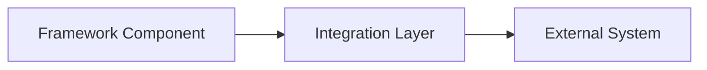

# Integration Title

> **Navigation**: [Knowledge Index](/knowledge/index.md) > [Integrations Index](/knowledge/integrations/index.md) > Integration Title
>
> **Prerequisites**: [Prerequisite 1](/path/to/prerequisite1.md), [Prerequisite 2](/path/to/prerequisite2.md)
>
> **Context**: This document provides information about integrating with [external system] from the framework.

## Purpose

Clear explanation of this integration, why it exists, and what value it provides to the framework.

## Prerequisites

Before implementing this integration, you should be familiar with:

- [Prerequisite 1](/path/to/prerequisite1.md) - Brief description of relevance
- [Prerequisite 2](/path/to/prerequisite2.md) - Brief description of relevance

## Integration Overview

High-level overview of the integration, including:
- What is being integrated
- Core functionality provided
- Integration patterns used
- Key components

## System Description

Description of the external system being integrated:
- Purpose and functionality
- Key capabilities
- Relevant limitations
- Version information
- Documentation references

## Integration Architecture

Description of the integration architecture:



Explanation of the architectural pattern and components.

## Connection Details

Information needed to establish a connection:
- Endpoint URLs
- Port requirements
- Protocol details
- Network configuration
- Firewall considerations

## Authentication

Authentication mechanisms for the integration:
- Authentication methods
- Credential management
- Security considerations
- Token handling
- Authentication flows

## Data Model

Description of the data model relevant to the integration:
- Key entities
- Data formats
- Schema information
- Data mapping
- Transformations required

## API Reference

Reference information for the integration API:

### Method 1: `method_name`

Description of the method.

**Parameters**:

| Name | Type | Required | Description | Default |
|------|------|----------|-------------|---------|
| param1 | string | Yes | Description of param1 | N/A |
| param2 | number | No | Description of param2 | 0 |

**Returns**:

Description of the return value.

### Method 2: `method_name`

[Follow the same structure as above for each method]

## Error Handling

How to handle errors in the integration:
- Error codes and meanings
- Exception handling
- Retry strategies
- Fallback mechanisms
- Logging recommendations

## Configuration

Configuration options for the integration:
- Required settings
- Optional settings
- Configuration examples
- Environment variable support
- Configuration validation

## Usage Examples

### Example 1: [Scenario Description]

```
Example code or usage pattern
```

Explanation of the example.

### Example 2: [Scenario Description]

```
Example code or usage pattern
```

Explanation of the example.

## Best Practices

- Best practice 1
- Best practice 2
- Best practice 3
- Best practice 4

## Limitations and Constraints

- Limitation 1 and potential workarounds
- Limitation 2 and potential workarounds
- Limitation 3 and potential workarounds
- Limitation 4 and potential workarounds

## Troubleshooting

Common issues and their solutions:

### Issue 1: [Problem Description]

**Symptoms**: How to identify this issue.

**Cause**: What causes this issue.

**Resolution**: How to resolve this issue.

### Issue 2: [Problem Description]

[Follow the same structure as above for each issue]

## Version Compatibility

Compatibility information:
- Framework version compatibility
- External system version compatibility
- Backward compatibility notes
- Upgrade considerations

## Related Integrations

- [Related Integration 1](/knowledge/integrations/related-integration1.md) - Brief description of relationship
- [Related Integration 2](/knowledge/integrations/related-integration2.md) - Brief description of relationship

## Next Steps

After reading this document, you may want to explore:

- [Next Step 1](/path/to/next1.md) - Brief description of relevance
- [Next Step 2](/path/to/next2.md) - Brief description of relevance

---

**Next Steps**: [Next Step 1](/path/to/next1.md) | [Next Step 2](/path/to/next2.md)

**Related Topics**: [Related Integration 1](/knowledge/integrations/related-integration1.md) | [Related Integration 2](/knowledge/integrations/related-integration2.md)

**Navigation Path**: [Home](/index.md) > [Knowledge](/knowledge/index.md) > [Integrations](/knowledge/integrations/index.md) > [Integration Title](/knowledge/integrations/integration-title.md)