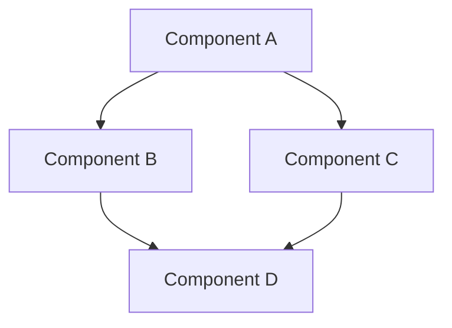

# Conceptual Knowledge Title

> **Navigation**: [Knowledge Index](/knowledge/index.md) > [Category Index](/knowledge/category/index.md) > Conceptual Knowledge Title
>
> **Prerequisites**: [Prerequisite 1](/path/to/prerequisite1.md), [Prerequisite 2](/path/to/prerequisite2.md)
>
> **Context**: This document explains the core concepts of [topic] and provides a foundational understanding necessary for working with the framework.

## Purpose

Clear explanation of what this concept represents, why it's important, and how it fits into the larger framework.

## Prerequisites

Before reading this document, you should be familiar with:

- [Prerequisite 1](/path/to/prerequisite1.md) - Brief description of relevance
- [Prerequisite 2](/path/to/prerequisite2.md) - Brief description of relevance

## Core Concept

Detailed explanation of the core concept, including its definition, key characteristics, and fundamental principles.

### Key Principles

List and explain the key principles that govern this concept:

1. **Principle 1**: Explanation of the first principle
2. **Principle 2**: Explanation of the second principle
3. **Principle 3**: Explanation of the third principle

### Components

Describe the main components or elements of this concept:

- **Component 1**: Purpose and characteristics
- **Component 2**: Purpose and characteristics
- **Component 3**: Purpose and characteristics

## Conceptual Model

Provide a conceptual model that illustrates the relationships between components or the structure of the concept.



## Application

Explain how this concept is applied within the framework:

### Use Cases

- **Use Case 1**: Description of how the concept is applied
- **Use Case 2**: Description of how the concept is applied
- **Use Case 3**: Description of how the concept is applied

### Implementation Examples

```
Example code or pattern showing the concept in practice
```

## Common Patterns

Describe common patterns associated with this concept:

### Pattern 1: [Pattern Name]

Description of the pattern, when to use it, and its benefits.

### Pattern 2: [Pattern Name]

Description of the pattern, when to use it, and its benefits.

## Anti-Patterns

Describe common anti-patterns or misuses of this concept:

### Anti-Pattern 1: [Anti-Pattern Name]

Description of the anti-pattern and why it should be avoided.

### Anti-Pattern 2: [Anti-Pattern Name]

Description of the anti-pattern and why it should be avoided.

## Related Concepts

- [Related Concept 1](/path/to/related1.md) - Brief description of relationship
- [Related Concept 2](/path/to/related2.md) - Brief description of relationship
- [Related Concept 3](/path/to/related3.md) - Brief description of relationship

## Next Steps

After reading this document, you may want to explore:

- [Next Step 1](/path/to/next1.md) - Brief description of relevance
- [Next Step 2](/path/to/next2.md) - Brief description of relevance

## References

- Internal Reference 1: [Document Name](/path/to/document.md)
- External Reference 1: [Resource Name](https://example.com)

---

**Next Steps**: [Next Step 1](/path/to/next1.md) | [Next Step 2](/path/to/next2.md)

**Related Topics**: [Related Concept 1](/path/to/related1.md) | [Related Concept 2](/path/to/related2.md)

**Navigation Path**: [Home](/index.md) > [Knowledge](/knowledge/index.md) > [Category](/knowledge/category/index.md) > [Conceptual Knowledge Title](/knowledge/category/conceptual-knowledge-title.md)