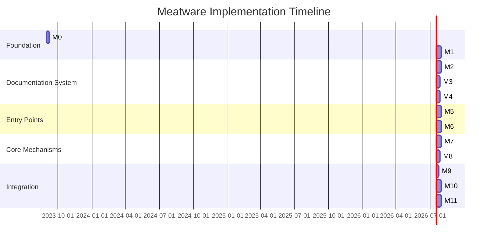

# Meatware: Implementation Roadmap

## Implementation Guidelines

### Development Approach
- Each milestone should be completed sequentially
- Use incremental development with regular testing
- Document design decisions in changelog
- Follow established metadata and linking conventions
- Regularly validate against success criteria

### Quality Standards
- All files must include proper metadata
- Navigation paths must be tested and validated
- Documentation must be clear and comprehensive
- Implementation must follow established conventions
- All components must be transparent and inspectable

### Testing Requirements
- Test with multiple AI assistants
- Validate with developers of varying experience levels
- Verify installation on different project types
- Ensure all navigation paths function correctly
- Validate context selection effectiveness

### Delivery Criteria
- All milestone deliverables complete
- Comprehensive documentation available
- All tests passing
- Package installation functioning correctly
- Success criteria validated and met

### Implementation Log Requirements
- Each milestone must include a corresponding log in `/project-implementation/implementation-log/`
- Implementation logs must be created following the format: `milestone-[#]-[name].md`
- Each log must document:
  - What was accomplished
  - Challenges encountered
  - Technical debt created
  - Next steps
- Implementation logs serve as a historical record and knowledge base for future development

## Roadmap Overview

This document outlines the implementation roadmap for the Meatware framework, organized into sequential phases with granular milestones. Each milestone represents a discrete deliverable with clear scope and dependencies.

## Milestones

### M0: Framework Initialization
- Create initial project structure
- Set up npm package configuration
- Define metadata standards and formats
- Create version control strategy
- Establish documentation standards

### M1: Core Directory Structure
- Create primary directory structure
- Implement basic templates for each section
- Set up metadata structure in YAML frontmatter
- Define file naming conventions
- Create initial index files

### M2: Self-Navigation System
- Implement navigation metadata in file headers
- Create standard sections for file relationships
- Develop master linking document
- Define navigation cues in file headers/footers
- Implement directory index files with summaries

### M3: Cross-Referencing Mechanism
- Implement consistent link syntax
- Create dependency tracking system
- Develop reference indexes
- Implement relationship visualization
- Create bidirectional linking mechanism

### M4: Knowledge Management
- Implement knowledge organization structure
- Create templates for different knowledge types 
- Develop changelog system
- Implement clarity documentation
- Create example knowledge entries

### M5: Campaign System (Documentation Entry Point)
- Create campaign.md interview process
- Implement progressive documentation sections
- Develop checklist format for tracking completion
- Create templates for systematic questioning
- Implement documentation status tracking

### M6: Conquer System (Execution Entry Point)
- Create conquer.md execution framework
- Implement task prioritization system
- Create specification linking system
- Develop implementation status tracking
- Implement decision logging system

### M7: Context Management
- Create context selection system
- Implement project state tracking
- Develop session history mechanism
- Create context caching system
- Implement context usage documentation

### M8: Command Registry
- Create command template structure
- Implement command categorization
- Develop command documentation format
- Create example commands for common tasks
- Implement command import/export mechanism

### M9: Package Installation
- Create npm installation script
- Implement template copying mechanism
- Develop configuration system
- Create initialization workflow
- Implement validation for proper installation

### M10: Documentation & Examples
- Create user documentation
- Implement quickstart guides
- Develop best practices documentation
- Create implementation showcases
- Implement troubleshooting guides

### M11: Testing & Validation
- Test installation on different project types
- Validate AI navigation effectiveness
- Test documentation quality and completeness
- Validate framework performance and footprint
- Test developer experience and mental load reduction

## Detailed Milestone Specifications

### M0: Framework Initialization

**Objective**: Set up the foundational project structure and establish standards for the development of the Meatware framework.

**Deliverables**:
- Project repository with proper structure
- npm package.json with configuration
- Documentation standards document
- Version control strategy document
- Metadata format specifications

**Tasks**:
- Set up git repository and initial commits
- Create package.json with proper metadata
- Define documentation format standards
- Establish version control workflow
- Create metadata schema for YAML frontmatter
- Define coding and documentation standards

**Dependencies**: None

**Implementation Log**: Create `/project-implementation/implementation-log/milestone-0-framework-initialization.md` documenting:
- Accomplishments and decisions made during implementation
- Challenges encountered during setup
- Any technical debt created
- Next steps for subsequent milestones

### M1: Core Directory Structure

**Objective**: Implement the complete directory structure for the Meatware framework with initial templates.

**Deliverables**:
- Complete directory hierarchy
- Base templates for each file type
- Index files for each directory
- File naming convention documentation
- README files for each major directory

**Tasks**:
- Create all primary directories (/knowledge, /specification, etc.)
- Create subdirectories with proper structure
- Develop templates for each file type
- Implement index files for directories
- Document file naming conventions
- Create README files explaining directory purposes

**Dependencies**: M0

**Implementation Log**: Create `/project-implementation/implementation-log/milestone-1-core-directory-structure.md` documenting:
- Directory structure implementation details
- Challenges in organizing and structuring content
- Technical debt related to templates and structure
- Recommendations for next milestone

### M2: Self-Navigation System

**Objective**: Implement the self-guiding system allowing AI tools to navigate the framework independently.

**Deliverables**:
- Navigation metadata implementation
- Standardized file sections for relationships
- Master linking document (index.md)
- Navigation cues in file headers/footers
- Complete directory index system

**Tasks**:
- Implement YAML frontmatter for navigation metadata
- Create standard sections for prerequisites, next steps, related files
- Develop the master linking document
- Implement navigation cues in file templates
- Create complete directory index files with file summaries
- Test navigation paths through the framework

**Dependencies**: M1

**Implementation Log**: Create `/project-implementation/implementation-log/milestone-2-self-navigation-system.md` documenting:
- Navigation system implementation details
- Challenges in creating AI-navigable paths
- Technical debt related to navigation conventions
- Findings from navigation path testing

### M3: Cross-Referencing Mechanism

**Objective**: Create a comprehensive system for cross-referencing and linking between framework components.

**Deliverables**:
- Standardized link syntax implementation
- Dependency tracking system
- Reference indexes
- Relationship visualization
- Bidirectional linking mechanism

**Tasks**:
- Implement consistent link syntax across all files
- Create dependency tracking in /context/dependencies.json
- Develop reference indexes in /context/references/
- Implement relationship visualization in /docs/maps/
- Create bidirectional linking mechanism
- Test cross-referencing across different file types

**Dependencies**: M2

**Implementation Log**: Create `/project-implementation/implementation-log/milestone-3-cross-referencing-mechanism.md` documenting:
- Cross-referencing implementation details
- Challenges in maintaining bidirectional links
- Technical debt in reference indexing
- Results of cross-reference testing

### M4: Knowledge Management

**Objective**: Implement the knowledge organization and management system for storing contextual information.

**Deliverables**:
- Knowledge organization structure
- Templates for different knowledge types
- Changelog system implementation
- Clarity documentation system
- Example knowledge entries

**Tasks**:
- Implement knowledge directory structure with subdirectories
- Create templates for different knowledge types (API, architecture, etc.)
- Develop the changelog system with timestamp formatting
- Implement clarity documentation for Q&A capturing
- Create example knowledge entries for each category
- Develop knowledge indexing system

**Dependencies**: M3

**Implementation Log**: Create `/project-implementation/implementation-log/milestone-4-knowledge-management.md` documenting:
- Knowledge structure implementation details
- Challenges in organizing different knowledge types
- Technical debt in knowledge organization
- Effectiveness of example knowledge entries

### M5: Campaign System (Documentation Entry Point)

**Objective**: Create the documentation entry point with a guided interview process for comprehensive documentation.

**Deliverables**:
- campaign.md interview process
- Progressive documentation sections
- Checklist format for tracking completion
- Templates for systematic questioning
- Documentation status tracking system

**Tasks**:
- Create campaign.md with structured interview process
- Implement progressive sections building on previous answers
- Develop checklist format to track documentation completion
- Create templates for systematic questioning by topic
- Implement documentation status tracking in /context/
- Test the documentation process flow

**Dependencies**: M4

**Implementation Log**: Create `/project-implementation/implementation-log/milestone-5-campaign-system.md` documenting:
- Campaign system implementation details
- Challenges in creating an effective interview process
- Technical debt in documentation structure
- Results of documentation process testing

### M6: Conquer System (Execution Entry Point)

**Objective**: Implement the execution entry point with task prioritization and implementation tracking.

**Deliverables**:
- conquer.md execution framework
- Task prioritization system
- Specification linking system
- Implementation status tracking
- Decision logging system

**Tasks**:
- Create conquer.md with execution framework structure
- Implement task prioritization methodology
- Develop system for linking to specifications
- Create implementation status tracking mechanism
- Implement decision logging for execution choices
- Test the execution process flow

**Dependencies**: M4

**Implementation Log**: Create `/project-implementation/implementation-log/milestone-6-conquer-system.md` documenting:
- Conquer system implementation details
- Challenges in creating effective task prioritization
- Technical debt in execution tracking
- Results of execution process testing

### M7: Context Management

**Objective**: Develop the context management system for intelligent selection and tracking of relevant information.

**Deliverables**:
- Context selection system
- Project state tracking mechanism
- Session history system
- Context caching implementation
- Context usage documentation

**Tasks**:
- Create context selection templates and rules
- Implement project state tracking in /context/state/
- Develop session history mechanism
- Create context caching system in /context/cached/
- Implement context usage documentation for transparency
- Test context selection across different scenarios

**Dependencies**: M3

**Implementation Log**: Create `/project-implementation/implementation-log/milestone-7-context-management.md` documenting:
- Context management implementation details
- Challenges in creating effective context selection
- Technical debt in caching and state tracking
- Results of context selection testing

### M8: Command Registry

**Objective**: Implement the command registry system for standardized AI interactions.

**Deliverables**:
- Command template structure
- Command categorization system
- Command documentation format
- Example commands for common tasks
- Command import/export mechanism

**Tasks**:
- Create command template structure with standard sections
- Implement command categorization by purpose
- Develop standard command documentation format
- Create example commands for common tasks
- Implement command import/export mechanism
- Test command execution with different AI tools

**Dependencies**: M7

**Implementation Log**: Create `/project-implementation/implementation-log/milestone-8-command-registry.md` documenting:
- Command registry implementation details
- Challenges in creating AI-agnostic commands
- Technical debt in command structures
- Results of command testing with different AI tools

### M9: Package Installation

**Objective**: Create the installation system for deploying Meatware to any project.

**Deliverables**:
- npm installation script
- Template copying mechanism
- Configuration system
- Initialization workflow
- Installation validation

**Tasks**:
- Create npm installation script
- Implement template copying mechanism
- Develop configuration system with defaults
- Create initialization workflow for new installations
- Implement validation for proper installation
- Test installation on different project types

**Dependencies**: M6, M8

**Implementation Log**: Create `/project-implementation/implementation-log/milestone-9-package-installation.md` documenting:
- Package installation implementation details
- Challenges in creating cross-project compatibility
- Technical debt in installation process
- Results of installation testing

### M10: Documentation & Examples

**Objective**: Create comprehensive documentation and examples for using the Meatware framework.

**Deliverables**:
- User documentation
- Quickstart guides
- Best practices documentation
- Implementation showcases
- Troubleshooting guides

**Tasks**:
- Create user documentation covering all framework aspects
- Implement quickstart guides for new users
- Develop best practices documentation
- Create implementation showcases demonstrating framework use
- Implement troubleshooting guides for common issues
- Test documentation clarity with different user types

**Dependencies**: M9

**Implementation Log**: Create `/project-implementation/implementation-log/milestone-10-documentation-examples.md` documenting:
- Documentation creation details
- Challenges in creating clear user guidance
- Technical debt in example implementations
- Results of documentation clarity testing

### M11: Testing & Validation

**Objective**: Thoroughly test and validate the Meatware framework against success criteria.

**Deliverables**:
- Installation testing results
- AI navigation effectiveness validation
- Documentation quality assessment
- Framework performance evaluation
- Developer experience testing

**Tasks**:
- Test installation on different project types
- Validate AI navigation effectiveness with different AI tools
- Test documentation quality and completeness
- Evaluate framework performance and footprint
- Test developer experience and mental load reduction
- Create validation report with findings

**Dependencies**: M10

**Implementation Log**: Create `/project-implementation/implementation-log/milestone-11-testing-validation.md` documenting:
- Testing methodology and approach
- Challenges encountered during validation
- Technical debt identified during testing
- Final recommendations for framework improvements